## 一、介绍

1. 使用Go语言进行服务端接口开发
2. 使用Gin、Gorm等组件，完成业务接口开发需求
3. 完成客户端交互与服务端接口的数据对接


## 二、内容

然后使用Go语言完成服务端接口开发，具体业务需求如下：

初始页面是应用启动后显示的第一个页面，可以上下滑动查看feed流。

1. 设计服务端接口协议，完善信息流接口

- 参考课堂提到的样例代码，独立完成feed流内容接口的定义和开发

1. 设计服务端接口协议及数据库表设计，支持用户注册登录功能

- 完善App页面右下角的“个人中心”，支持输入用户名+密码完成注册、登录的功能
- 支持用户退出登录

1. 设计服务端接口协议及数据库表设计，支持点赞功能

- 每个feed流中的文章，会显示该文章累计获得的点赞总数
- 用户登录状态下， 每个文章会显示用户是否已经点赞过，如果点赞过，则会显示为红色实心的“心”，没有点赞过，则显示空心的“心”。
- 用户可以对文章进行点赞和取消点赞操作。如果用户未登录，则服务端接口返回未登录，客户端页面跳转用户登录注册界面。如果用户已登录，则可以进行点赞和取消点赞。
- 一个登录用户最多只能点赞同一文章一次，对已点赞的文章再次点赞，则相当于进行取消点赞操作。


## 三、结果

### (1)截图

* 服务器启动

  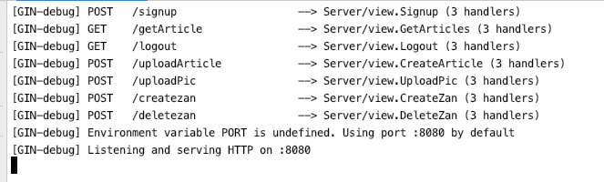

* 启动客户端要求登录

  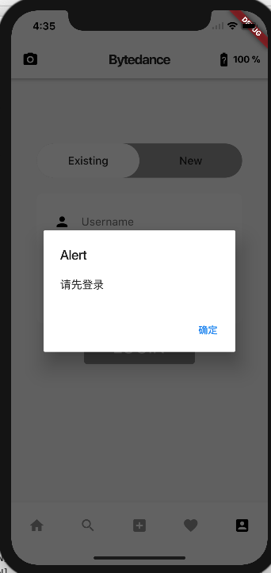

* 未登录时文章页面要求登录

  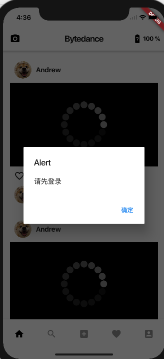

* 注册页面

  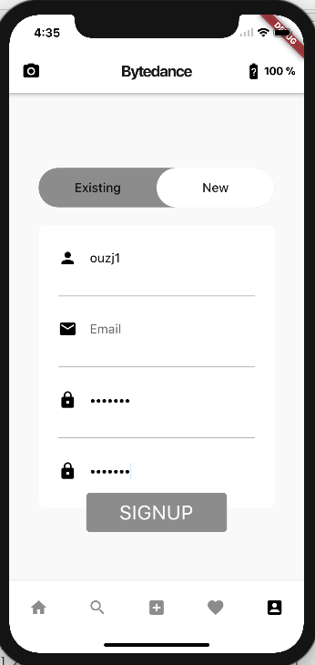

* 后台注册信息

  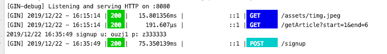

* 登录界面

  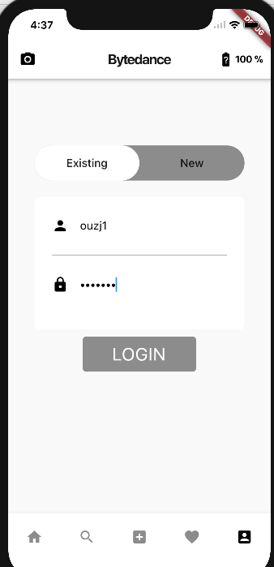

* 登录后信息

  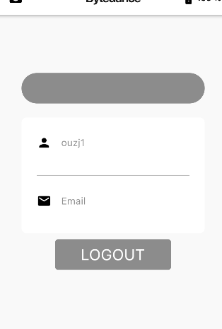

* 后台登录登出信息

  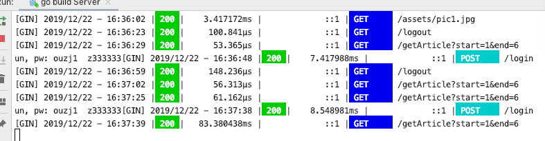

* 登录后的文章界面

  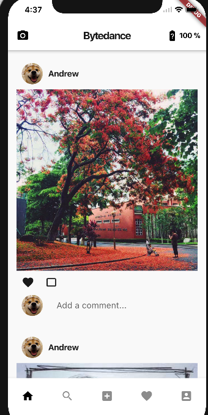

* 后台图片获取信息

  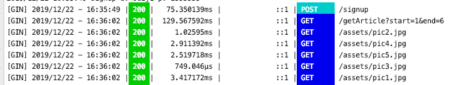

* 点赞后台信息

  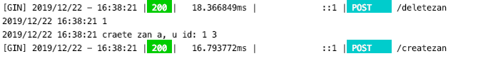


### (2)实验步骤以及关键代码

#### 1. 服务端接口设计：

1. 注册接口

接口URL: `"/signup"`

请求方式:`"POST"`

请求参数:

```
"username": string //用户名
"password": string //密码
```

返回字段

```
"status":  string  //登录状态
"msg":		string 	//信息
```

请求样例

```
curl -X POST -d "username=ouzj5&password=123" localhost:8080/signup 
或
curl -X POST -d "username=ouzj5" -d "password=123" localhost:8080/signup 
```


2. 登录接口

接口URL：`"/login"`

请求方式：`"POST"`

请求参数：

```
"username": string //用户名
"password": string //密码
```

返回字段：

```
"status":  string  //登录状态
"msg":		string 	//信息
```

请求样例

```
curl -X POST -d "username=ouzj5&password=123" localhost:8080/login
或
curl -X POST -d "username=ouzj5" -d "password=123" localhost:8080/login
```


3. 获取文章接口

接口URL：`/getArticle`

请求方式：`GET`

请求参数：

```
"start": string ，文章开始ID
"end":	string	，文章结束ID
```

返回字段：

```
"status": "success"
"msg": "get articles"
"data": []ArticleRes
ArticleRes结构体字段: 
struct {
	ID uint;	`json:"id"`
	Title string;	`json:"title"`
	Imgurl string;	`json:"imgurl"`
	Zan	uint;		`json:"zan"`
}
```


请求样例：

```
curl -G -d "start=1&end=4" localhost:8080/getArticle
```


4. 上传文章接口

接口URL：`/uploadArticle`

请求方式：`POST`

请求参数：

```
"title" : "title of article"
"imgid" : "id of the img"
"uid" : "id of the author"
```

返回字段：

```
"status" : "success / error"
"msg" : "create wrong / create success"
```

请求样例：

```
curl -X POST -d "title=t1&imgid=1&uid=1" localhost:8080/uploadArticle
curl -X POST -d "title=t2&imgid=2&uid=1" localhost:8080/uploadArticle
curl -X POST -d "title=t3&imgid=3&uid=1" localhost:8080/uploadArticle
curl -X POST -d "title=t4&imgid=4&uid=1" localhost:8080/uploadArticle
curl -X POST -d "title=t5&imgid=5&uid=1" localhost:8080/uploadArticle
curl -X POST -d "title=t6&imgid=6&uid=1" localhost:8080/uploadArticle
curl -X POST -d "title=t7&imgid=7&uid=1" localhost:8080/uploadArticle
```


5. 上传文章图片接口

接口URL：`/uploadPic`

请求方式：`POST`

请求参数：

```
"pic": FormFile
```

返回字段：

```
"status": "success / error"
"msg":	"upload sucess/ wrong"
```

请求样例：

```
curl -X POST -F "pic=@pic.jpg" localhost:8080/uploadPic -H "Content-Type: multipart/form-data"
```

6. 点赞接口

接口URL：`creatzan`

请求方式：`POST`

请求参数：

```
"aid": "id of the article"
"uid": "id of the user"
```

返回字段：

```
string: "accetped", 
status: http.StateusOk
```

请求样例：

```
curl -X POST -d "aid=1&uid=1" localhost:8080/createzan
```

7. 取消点赞接口

接口URL：`deletezan`

请求方式：`POST`

请求参数：

```
"aid": "id of the article"
"uid": "id of the user"
```

返回字段：

```
string: "accetped", 
status: http.StateusOk
```

请求样例：

```
curl -X POST -d "aid=1&uid=1" localhost:8080/deletezan
```

#### 2. 结构体设计

* 文章存储

  ```
  type Article struct {
     ID        uint `gorm:"primary_key"`
     CreatedAt time.Time
     UpdatedAt time.Time
     UserID    uint
     Title     string `form:"not null"`
     ImgID     uint
     Zan       []Zan
  }
  ```

* 文章响应

  ```
  type ArticleRes struct {
     ID     uint   `json:"id"`
     Title  string `json:"title"`
     Imgurl string `json:"imgurl"`
     Zan    int    `json:"zan"`
  }
  ```

* 图片存储

  ```
  type Pic struct {
     ID        uint `gorm:"primary_key"`
     CreatedAt time.Time
     UpdatedAt time.Time
     url       string
  }
  ```

* 用户信息存储

  ```
  type User struct {
     ID        uint `gorm:"primary_key"`
     CreatedAt time.Time
     UpdatedAt time.Time
     Username  string `gorm:"unique"`
     Password  string `gorm:"not null;"`
     Article   []Article
     Zan       []Zan
  }
  ```

* 点赞信息存储

  ```
  type Zan struct {
     UserID    uint `gorm:"unique_index:zid"`
     ArticleID uint `gorm:"unique_index:zid"`
  }
  ```


#### 3. 数据库SQL

* 创建文章

  ```
  article := Article{UserID: uid, Title: title, ImgID: imgid}
  if db.Create(&article).Error != nil {
     return 0
  }
  ```

* 获取文章

  ```
  if result := db.Where("id = ?", aid).First(&article); result.Error != nil {
     log.Print("artice get failed")
     return article, errors.New("no this article")
  }
  ```

* 创建图片

  ```
  if db.Create(&pic).Error != nil {
  		return 0
  	}
  ```

* 创建用户

  ```
  user := User{Username: username, Password: password}
  defer db.Close()
  if db.Create(&user).Error != nil {
     return 0
  }
  ```

* 查找用户

  ```
  var user User
  	if result := db.Where("id = ?", uid).First(&user); result.Error != nil {
  		log.Print(result.Error.Error())
  	}
  ```

* 点赞(创建赞信息)

  ```
  zan := Zan{UserID: uid, ArticleID: aid}
  	if res := db.Create(&zan); res.Error != nil {
  		log.Print("create zan failed: " + res.Error.Error())
  	}
  ```

* 取消赞（删除赞信息）

  ```
  if result := db.Where("user_id = ? and article_id = ?", uid, aid).Delete(Zan{}); result.Error != nil {
     log.Print("zan delete failed")
  }
  ```

* 查看赞（文章初始化时使用）

  ```
  result := db.Where("user_id = ? and article_id = ?", uid, aid).First(&zan);
  ```

#### 4. 客户端部分

* 使用Dio发送请求，如获得文章

  ```
  Response res = await new Mydio().dio.get("http://localhost:8080/getArticle",
            queryParameters: {"start": "1", "end": "6"});
        if (res.statusCode == HttpStatus.ok) {
          data = jsonDecode(res.toString());
          if (data['status'] == "error") {
            new Mydialog().getDialog(this.context, "请先登录");
            widget.setIndex(1);
            new MyState().reset();
            print(res.toString());
            return;
          }
        }
  ```

* 使用cookieJar管理服务端发送的cookie，以保持登录状态。

  ```
  dio = new Dio();
      cookieJar = new CookieJar();
      dio.interceptors.add(CookieManager(cookieJar));
      dio.options.contentType = ContentType.parse("application/x-www-form-urlencoded").toString();
      dio.cookieJar.loadForRequest(Uri.parse("http://localhost:8080/login"))
  ```

  

### (3)遇到的困难以及解决思路

1. 如何实现点赞功能。创建一个点赞信息表存储，每条信息添加用户id和文章id，从而获得每个用户对每篇文章的点赞情况。创建点赞就添加记录，取消点赞就删除记录。
2. flutter客户端的网络请求。使用dio网络实现请求，不过要注意就是ContentType以及参数和请求方式。
3. 登录状态的持续。使用dio中的cookieJar扩展，每次发送请求时带上cookie，另外设置一个dio单例，从而实现所有的请求共享cookie。

   

